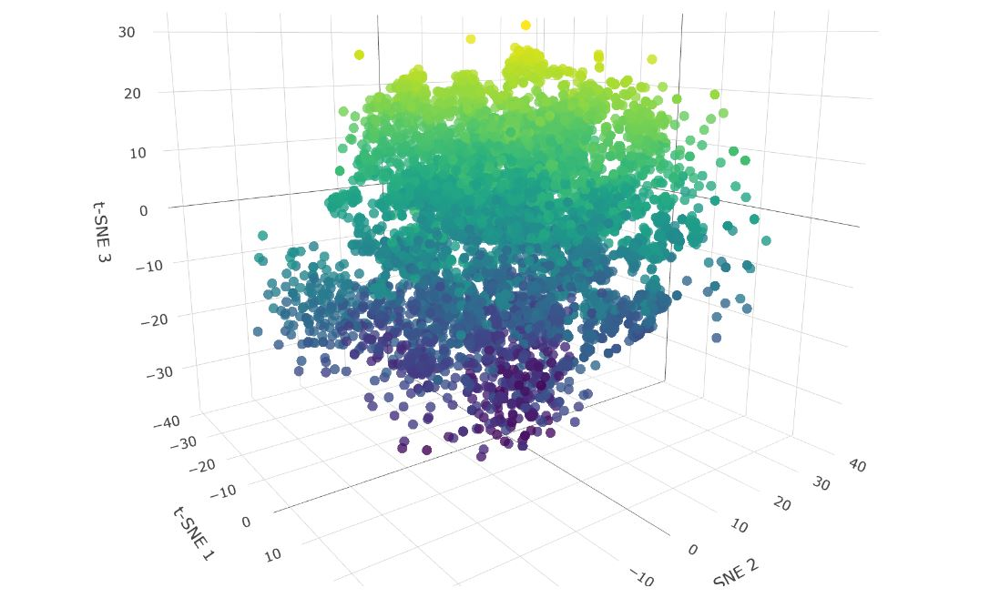

# 🏆 Swahili Text Embeddings Leaderboard (STEL)

<p align="center">
    
</p>


Welcome to the **Swahili Text Embeddings Leaderboard (STEL)**! This is a **Sartify LLC project** aimed at creating a centralized leaderboard for Swahili text embeddings. The models listed here are evaluated using various Swahili text datasets available at MTEB benchmarks. Contributions and corrections are always welcome! We define a model as "open" if it can be locally deployed and used commercially.


## Table of Contents
- [Interactive Dashboard](#-interactive-dashboard)
- [Leaderboard](#-leaderboard)
- [Evaluation](#-evaluation)
- [How to Contribute](#-how-to-contribute)
- [Sponsorship](#-sponsorship)

## 🌐 Interactive Dashboard

Explore our interactive dashboards:

- [Streamlit Dashboard](https://swahili-llm-leaderboard.streamlit.app/)
- [Hugging Face Space](https://huggingface.co/spaces/sartifyllc/Swahili-Text-Embeddings-Leaderboard)

## 📊 Leaderboard
| Model Name                                                                                                                                       | Publisher      | Open?   | Basemodel                 | Matryoshka   | Dimension   |   Average |   AfriSentiClassification |   AfriSentiLangClassification |   MasakhaNEWSClassification |   MassiveIntentClassification |   MassiveScenarioClassification |   SwahiliNewsClassification |   NTREXBitextMining |   MasakhaNEWSClusteringP2P |   MasakhaNEWSClusteringS2S |    XNLI |   MIRACLReranking |   MIRACLRetrieval |
|:-------------------------------------------------------------------------------------------------------------------------------------------------|:---------------|:--------|:--------------------------|:-------------|:------------|----------:|--------------------------:|------------------------------:|----------------------------:|------------------------------:|--------------------------------:|----------------------------:|--------------------:|---------------------------:|---------------------------:|--------:|------------------:|------------------:|
| [MultiLinguSwahili-serengeti-E250-nli-matryoshka](https://huggingface.co/sartifyllc/MultiLinguSwahili-serengeti-E250-nli-matryoshka)             | sartifyllc     | Yes     | serengeti-E250            | Yes          | 768         |   51.3997 |                   45.4011 |                       77.6318 |                     71.4496 |                       56.4492 |                         61.2038 |                     63.9453 |           63.4926   |                    38.6383 |                   32.6575  | 77.0157 |            19.287 |             9.624 |
| [MultiLinguSwahili-bert-base-sw-cased-nli-matryoshka](https://huggingface.co/sartifyllc/MultiLinguSwahili-bert-base-sw-cased-nli-matryoshka)     | sartifyllc     | Yes     | bert-base-sw-cased        | Yes          | 768         |   42.2575 |                   35.4278 |                       82.2461 |                     64.8529 |                       46.1332 |                         50.5649 |                     57.041  |            5.16086  |                    37.6302 |                   19.7916  | 68.5115 |            22.57  |            17.16  |
| [MultiLinguSwahili-mxbai-embed-large-v1-nli-matryoshka](https://huggingface.co/sartifyllc/MultiLinguSwahili-mxbai-embed-large-v1-nli-matryoshka) | sartifyllc     | Yes     | mxbai-embed-large-v1      | Yes          | 768         |   40.0694 |                   36.7914 |                       81.9434 |                     54.2647 |                       46.7182 |                         51.2206 |                     57.2949 |            5.4534   |                    34.5571 |                    9.27166 | 70.311  |            21.831 |            11.176 |
| [mxbai-embed-large-v1](https://huggingface.co/mixedbread-ai/mxbai-embed-large-v1)                                                                | mixedbread-ai  | Yes     | mxbai-embed-large-v1      | N/A          | N/A         |   39.6734 |                   35.0802 |                       83.4229 |                     57.416  |                       43.8635 |                         47.1923 |                     54.4678 |            5.87399  |                    27.5669 |                   21.1763  | 56.0497 |            23.742 |            20.229 |
| [bert-base-uncased-swahili](https://huggingface.co/flax-community/bert-base-uncased-swahili)                                                     | flax-community | Yes     | bert-base-uncased-swahili | N/A          |             |   37.8727 |                   41.123  |                       80.8838 |                     66.0714 |                       48.302  |                         51.9334 |                     64.2236 |            0.400601 |                    18.6071 |                    2.04101 | 58.9762 |            13.807 |             8.103 |
| [MultiLinguSwahili-bge-small-en-v1.5-nli-matryoshka](https://huggingface.co/sartifyllc/MultiLinguSwahili-serengeti-E250-nli-matryoshka)          | sartifyllc     | Yes     | bge-small-en-v1.5         | Yes          | 256         |   36.3029 |                   35.107  |                       67.3486 |                     54.1597 |                       38.0027 |                         46.8393 |                     51.2305 |            5.01061  |                    21.7986 |                   17.8461  | 62.3059 |            21.521 |            14.465 |
| [bert-base-sw-cased](https://huggingface.co/Geotrend/bert-base-sw-cased)                                                                         | Geotrend       | Yes     | bert-base-sw-cased        | N/A          | N/A         |   33.6552 |                   35.3342 |                       84.3066 |                     62.3109 |                       36.3685 |                         38.7996 |                     57.9199 |            0.396624 |                    12.9566 |                    6.77267 | 55.6602 |            10.077 |             2.959 |
| [UBC-NLPserengeti-E250](https://huggingface.co/UBC-NLP/serengeti-E250)                                                                           | UCB            | Yes     | UBC-NLPserengeti-E250     | N/A          | N/A         |   33.581  |                   44.0374 |                       84.3848 |                     42.1008 |                       37.1957 |                         38.2414 |                     58.1592 |           12.7676   |                    15.7357 |                   14.7948  | 53.3967 |             2.041 |             0.117 |
## 🧪 Evaluation
To evaluate a model on the Swahili Embeddings Text Benchmark, you can use the following Python script:
```python
pip install mteb
pip install sentence-transformers
import mteb
from sentence_transformers import SentenceTransformer

model_name = "MultiLinguSwahili-serengeti-E250-nli-matryoshka"	
publisher = "sartifyllc"
models = ["sartifyllc/MultiLinguSwahili-bert-base-sw-cased-nli-matryoshka", f"{publisher}/{model_name}"]

for model_name in models:
    truncate_dim = 768
    language = "swa"
    
    device = torch.device("cuda:1" if torch.cuda.is_available() else "cpu") # if cuda available
    # model = SentenceTransformer(model_name, truncate_dim = truncate_dim, device = device, trust_remote_code=True) # if you want to use matryoshka n dimension
    model = SentenceTransformer(model_name, device = device, trust_remote_code=True)
    
    tasks = [
        mteb.get_task("AfriSentiClassification", languages = ["swa"]),
        mteb.get_task("AfriSentiLangClassification", languages = ["swa"]),
        # "LanguageClassification": "accuracy",
        mteb.get_task("MasakhaNEWSClassification", languages = ["swa"]),
        mteb.get_task("MassiveIntentClassification", languages = ["swa"]),
        mteb.get_task("MassiveScenarioClassification", languages = ["swa"]),
        mteb.get_task("SwahiliNewsClassification", languages = ["swa"]),
        # mteb.get_tasks(task_types=["PairClassification", "Reranking", "BitextMining", "Clustering", "Retrieval"], languages = ["swa"]),
    ]
    
    
    evaluation = mteb.MTEB(tasks=tasks)
    results = evaluation.run(model, output_folder=f"{model_name}")
    
    # results = evaluation.run(model, output_folder=f"{model_name}")
    tasks = mteb.get_tasks(task_types=["PairClassification", "Reranking", "BitextMining", "Clustering", "Retrieval"], languages = ["swa"])
    
    evaluation = mteb.MTEB(tasks=tasks)
    results = evaluation.run(model, output_folder=f"{model_name}")
```


## 🤝 How to Contribute

We welcome and appreciate all contributions! You can help by:

### Table Work

- Filling in missing entries.
- New models are added as new rows to the leaderboard (maintaining descending order).
- Add new benchmarks as new columns in the leaderboard and include them in the benchmarks table (maintaining descending order).

### Code Work

- Improving the existing code.
- Requesting and implementing new features.

## 🤝 Sponsorship

This benchmark is Swahili-based, and we need support translating and curating more tasks into Swahili. Sponsorships are welcome to help advance this endeavour. Your sponsorship will facilitate essential translation efforts, bridge language barriers, and make the benchmark accessible to a broader audience. We are grateful for the dedication shown by our collaborators and aim to extend this impact further with the support of sponsors committed to advancing language technologies.

---

Thank you for being part of this effort to advance Swahili language technologies!